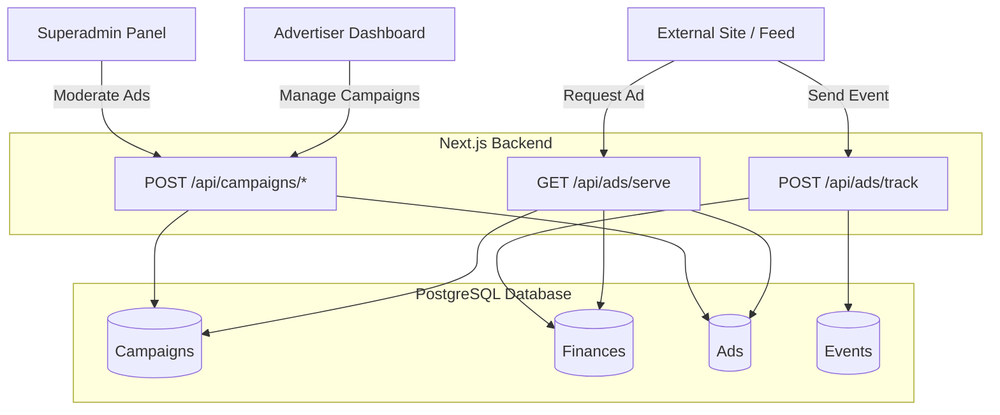
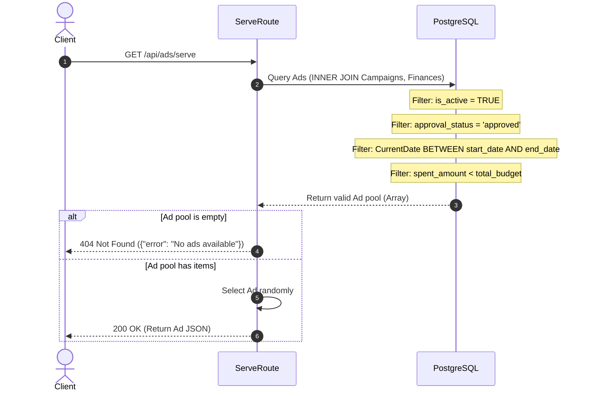
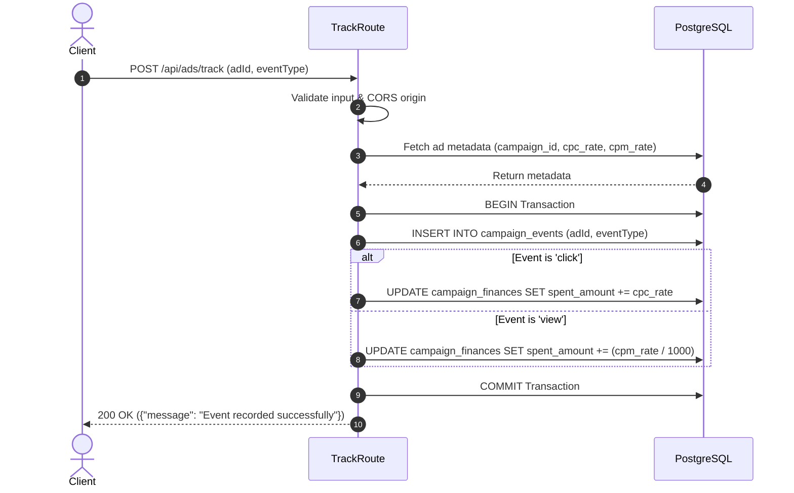
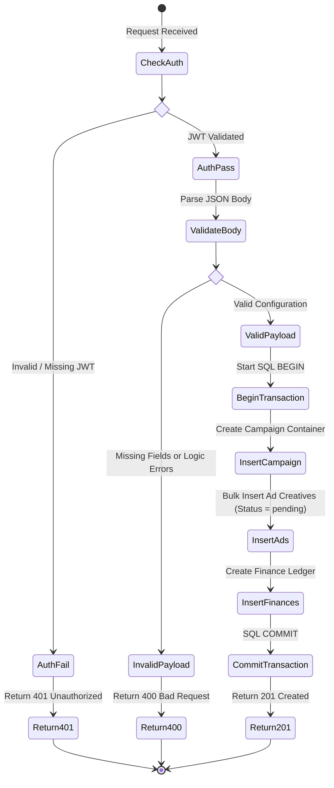

# Self-Serve Native Ad Platform API

A decoupled Next.js REST API and Dashboard for managing, serving, and tracking native advertising campaigns with real-time financial tracking and atomic PostgreSQL concurrency control.

---

Here are the exact commands required to build, run, and test the project.

## Install Dependencies
To install dependencies and prepare the environment:
```bash
npm install
```

## Configure Environment
Create a `.env.local` file in the project root containing your PostgreSQL connection string and a secret token:
```env
DATABASE_URL=postgresql://<user>:<password>@<host>/<database>?sslmode=require
JWT_SECRET=your-secure-secret-key
```

## Initialize Database & Seed Mock Data
To provision the required PostgreSQL schemas (including video creative support) and populate the database with mock campaigns, run:
```bash
node migration.mjs
node migration_add_video.mjs
node seed.mjs
```

## Start the Server
To start the Next.js development server on port `3000`:
```bash
npm run dev
```

---

## 3. Project Structure & Layout

The project structure cleanly separates UI components from backend API routes and database logic:

```text
ad-module/
├── README.md              # Project documentation and API blueprint
├── package.json           # Node.js dependencies and scripts
├── .env.local             # Environment configuration (not committed)
├── src/
│   ├── app/
│   │   ├── api/           # Backend REST API Routes
│   │   │   ├── ads/       # Endpoints: serve, track
│   │   │   ├── campaigns/ # Endpoints: create, update, moderate
│   │   │   └── settings/  # CORS / Settings configuration
│   │   ├── dashboard/     # Authenticated React UI Views
│   │   └── (auth)/        # Login, Register, Logout handling
│   ├── components/        # Reusable React components (Forms, Charts)
│   └── lib/               # Database pool and Auth utilities
├── migration.mjs          # Core database schema definitions
├── migration_add_video.mjs# Database patch for video ad support
└── seed.mjs               # Mock data population script
```

---

## 4. Step-by-Step API Testing & Validation

Below are the `curl` commands for each primary endpoint, demonstrating exact inputs and expected outputs.

### 4.1 Endpoint 1: Request an Ad (Serve)
* **Route:** `GET /api/ads/serve`
* **Curl Command:**
  ```bash
  curl -X GET http://localhost:3000/api/ads/serve
  ```
* **Success Response (`200 OK`):**
  ```json
  {
    "id": 15,
    "title": "Summer Tech Sale",
    "description": "Upgrade your setup with a 20% discount.",
    "imageUrl": "https://example.com/ad-image.jpg",
    "videoUrl": null,
    "destinationUrl": "https://example.com/sale",
    "ctaText": "Shop Now",
    "companyName": "TechStore Inc"
  }
  ```
  *(Note: The system securely filters out paused, rejected, or budget-exhausted campaigns before serving).*

### 4.2 Endpoint 2: Track an Ad Event
* **Route:** `POST /api/ads/track`
* **Curl Command (Track a View/Impression):**
  ```bash
  curl -X POST http://localhost:3000/api/ads/track \
       -H "Content-Type: application/json" \
       -d '{"adId": 15, "eventType": "view"}'
  ```
* **Success Response (`200 OK`):**
  ```json
  {
    "message": "Event recorded successfully"
  }
  ```
* **Validation Failure (`400 Bad Request`):**
  ```json
  {
    "error": "Missing required fields"
  }
  ```

### 4.3 Endpoint 3: Create a Campaign (Authenticated)
* **Route:** `POST /api/api/campaigns/create`
* **Curl Command:**
  *(Requires valid JWT `auth_token` cookie from login)*
  ```bash
  curl -X POST http://localhost:3000/api/campaigns/create \
       -H "Content-Type: application/json" \
       -H "Cookie: auth_token=eyJhbGciOiJIUzI1..." \
       -d '{
             "companyName": "TechStore",
             "duration": "14",
             "billingType": "BOTH",
             "cpcRate": 1.5,
             "cpmRate": 10.0,
             "totalBudget": 500.0,
             "ads": [{
               "title": "Summer Tech Sale",
               "description": "Upgrade your setup.",
               "destinationUrl": "https://example.com/sale",
               "imageUrl": "https://example.com/image.jpg",
               "videoUrl": ""
             }]
           }'
  ```
* **Success Response (`201 Created`):**
  ```json
  {
    "message": "Campaign and ads submitted successfully!",
    "campaignId": 42
  }
  ```

---

## 5. Architecture & Low-Level Design (LLD)

### 5.1 System Architecture Diagram



---

### 5.2 Sequence Diagram (GET /api/ads/serve)



---

### 5.3 Sequence Diagram (POST /api/ads/track)



---

### 5.4 Endpoint Activity Diagram (`POST /api/campaigns/create`)



---

## 6. Granular API Endpoint Blueprint & Internal Workflow

Here is the exact step-by-step execution flow for the platform's core endpoints.

#### Endpoint 1: Serve an Ad
*   **HTTP Method:** `GET`
*   **Route:** `/api/ads/serve`
*   **Primary Aim:** Efficiently query the database for a valid ad creative that meets all operational criteria (active, approved, within date range, and under budget) and return it to the external client.
*   **Step-by-Step Under-the-Hood Workflow:**
    *   **Request Intake:** Client hits the endpoint. CORS validation is performed via middleware/headers.
    *   **Database Query:** A complex SQL `SELECT` performs `INNER JOIN` operations linking the `ads`, `campaigns`, and `campaign_finances` tables.
    *   **Financial & State Constraints:** The `WHERE` clause strictly filters out ads if:
        *   The campaign is globally paused (`c.is_active = FALSE`).
        *   The ad is not approved (`a.approval_status != 'approved'`).
        *   The timeline has expired (`CURRENT_TIMESTAMP > c.end_date`).
        *   The budget is exhausted (`cf.spent_amount >= cf.total_budget`).
    *   **Selection Logic:** The API receives the pool of valid candidates and selects one at random to ensure even network distribution.
    *   **Response Construction:** Returns HTTP `200 OK` mapping internal database columns to a clean, client-facing JSON object.

#### Endpoint 2: Track Event & Process Billing
*   **HTTP Method:** `POST`
*   **Route:** `/api/ads/track`
*   **Primary Aim:** Log user interactions immutably and perform real-time, atomic ledger updates to campaign budgets based on their CPC/CPM rates.
*   **Step-by-Step Under-the-Hood Workflow:**
    *   **Request Intake:** Client posts a JSON body containing `adId` and `eventType` (e.g., `view`, `click`, `video_start`).
    *   **Ad Discovery:** Queries the database to retrieve the associated `campaign_id` and the specific financial rates (`cpc_rate`, `cpm_rate`) for that ad's parent campaign.
    *   **Transaction Initialization:** Executes an SQL `BEGIN` block to guarantee ACID properties.
    *   **Event Logging:** Inserts a new row into `campaign_events` capturing the exact timestamp of the interaction.
    *   **Financial Mutability Calculation:** 
        *   If the event is a `click`, it adds the exact `cpc_rate`.
        *   If the event is a `view`, it calculates the micro-cent cost by dividing the `cpm_rate` by 1000.
    *   **Ledger Update:** Executes an `UPDATE campaign_finances` query applying the exact delta to `spent_amount`.
    *   **Commit:** Executes SQL `COMMIT`. If any step fails, the entire sequence is `ROLLBACK`'ed safely.
    *   **Response Construction:** Returns HTTP `200 OK` to confirm receipt.
